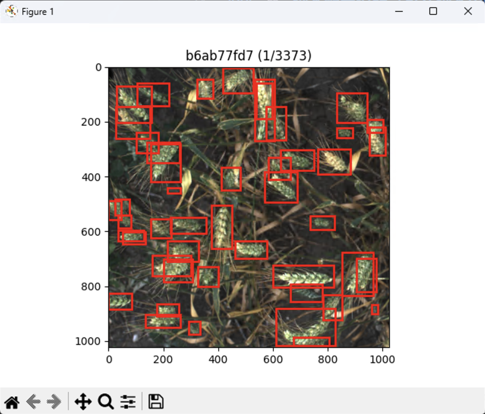

## 📦 Bounding Box 可视化工具

这是一个简单实用的 Python 工具，用于从 CSV 文件读取目标检测框（bounding box）并在图像上可视化。支持键盘翻页功能，适合调试和预览标注数据。

---

### 📁 项目结构示例

```
your_project/
├── train.csv
├── train/                # 图片文件夹
│   ├── 0001.jpg
│   ├── 0002.jpg
├── visualize.py
├── requirements.txt
└── README.md
```

---

### 📄 CSV 文件格式要求

CSV 文件中应包含以下字段（默认列名，可在脚本中修改）：

* `image_id`: 图片文件名（不含后缀）
* `bbox`: bbox 列格式为字符串，例如 `"[x, y, width, height]"`

示例 `train.csv` 内容：

```csv
image_id,width,height,bbox
0001,1024,768,"[100, 200, 300, 150]"
0001,1024,768,"[400, 300, 50, 50]"
0002,640,480,"[50, 60, 100, 80]"
```

---

### 🚀 使用方法

#### 安装依赖

```bash
pip install -r requirements.txt
```

#### 运行脚本

```bash
python visualize.py
```

或者自定义参数：

```bash
python visualize.py --csvpath your_csv.csv --image your_image_folder/
```

---

### ⌨️ 键盘控制

* `→`：下一张图像
* `←`：上一张图像
* `Esc`：退出可视化窗口

---

### ⚙️ 脚本配置说明（可在脚本中修改）

```python
config = {
    'csvpath': 'train.csv',             # 默认 CSV 路径
    'image_dir': './train',             # 默认图像文件夹
    'image_id_col': 'image_id',         # 图片名列名
    'bbox_col': 'bbox'                  # bbox 列名
}
```

如果你的数据格式不同，只需修改 `config` 字典即可，无需改动主逻辑。

---

---

### 📷 效果示意


